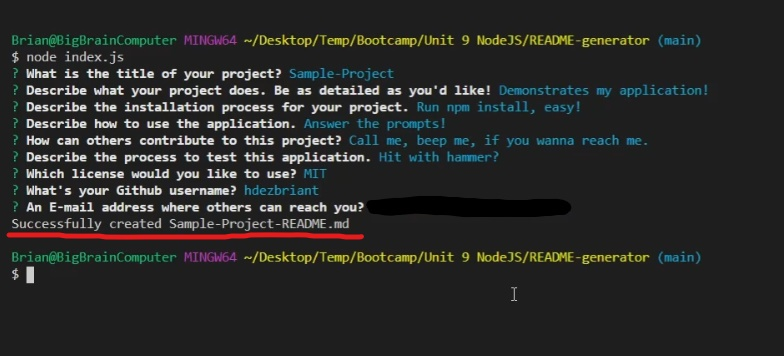

# Professional README Generator 

## Table of Contents
- [Description](#Description)
- [Installation](#Install-Instructions)
- [Usage](#Usage)
- [Contribution](#Contribution-Guidelines)
- [License](#License)
- [Questions](#Questions-Contact-Me)
- [Credits](#Credits)

## Description
Ever feel like you're spending maybe a little too much time writing your README files for your projects?
I do! That's why I've created this cute little command line app to automate that process for me!
You can use this application to answer a series of prompts for common sections found in a README file,
and the app will generate the markdown file for you automatically!
  
## Install Instructions  
Just download or clone this repository, open up your preferred terminal, run npm install, and you're ready to go!
From here, just run `node index.js` and you're goin'!
  
## Usage  
After installing the included npm packages(don't forget this!), simply run `node index.js` in your preferred command line terminal,
and you'll be met with a series of prompts. The responses you provide to those prompts will be what is used to generate the README
file, so be sure to type carefully and completely!
(If you mess up, you can just run the application again with the same Project Title, and your answers will simply overwrite the
existing file, no worries!)  
Click the image for a video guide if you'd like to see it in action!
  

  
## Contribution Guidelines  
If you'd like to contribute to this project in some way, please contact me through Github or the email listed at the bottom 
of this file! I'd love to collaborate to improve and optimize this project, so don't be shy!

## License 
[The MIT License](https://opensource.org/licenses/MIT)

## Questions? Contact Me!
Here's a link to my [Github!](https://github.com/hdezbriant)  
... Or shoot me an E-mail! <hernandez.briant@gmail.com>  

## Credits
### As always, a very caffeinated thank you to everyone who stayed up with me while we worked!    
[William Lucht](https://github.com/d606n6k),\
[Tyler Abegg](https://github.com/UnDuhDuhSea),\
[Christian Payan](https://github.com/chrispayan), and\
[Arvin John Bautista](https://github.com/irvinek01)
